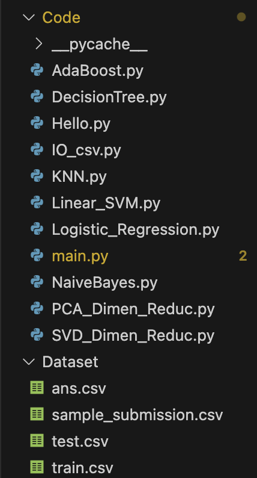

# README

# CS7304H: Statistical Learning 2024 Fall Project

[CS7304H__Statistical_Learning_2024_Fall_Project.pdf](Document/CS7304H__Statistical_Learning_2024_Fall_Project.pdf)

# 文件目录



## Dataset文件夹

其中Dataset文件夹中为数据集和测试集的位置。

- train.csv：训练数据集
- test.csv：测试数据集
- sample_submission.csv：分类结果的一个格式示例
- ans.csv：对测试集的分类结果

## Code文件夹

包含了所有的python代码，可分为以下几种类型

- 主程序
    - main.py：控制主程序
- 输入输出
    - IO_csv.py：文件读入和输出，可通过设置shuffle_row决定是否要打乱输入
- 数据降维实现
    - SVD_Dimen_Reduc.py：奇异值分解降维代码实现
    - PCA_Dimen_Reduc.py：PCA降维代码实现
- 模型实现
    - AdaBoost.py：通过sklearn实现，效果并不好
    - DecisionTree.py：通过sklearn实现，效果不好
    - KNN.py：通过sklearn实现，且手动编程实现。但sklearn支持了kd-tree和ball-tree，因此执行效率会高很多。
    - Linear_SVM.py：调适未通过，目前无法使用
    - Logistic_Regression.py：通过sklearn实现，且手动编程实现。但sklearn的实现效率高很多，而且此处我并非使用多分类而是通过重复训练label个数个2分类器实现。
    - NaiveBayes.py：通过sklearn实现，且手动编程实现。
        - sklearn支持了Gaussian，Bernoulli，Multinomial，Categorical，Complement。其中在测试集上表现最好的是Multinomial。
        - 自主实现支持了Gaussian和Multinomial。

# 使用步骤

## Python支持库

- numpy
- sklearn（scikit-learn）
- random
- math
- os
- csv
- collections
- cvxopt

## 运行指令

```bash
cd Code
python main.py
```

## 方法选择

目前数据降维方法选择，数据划分选择，模型选择均需要手动调整程序中的参数实现。

- dimensionality_reduction_type
    - 0：不进行数据降维
    - 1：PCA降维（通过sklearn实现）
    - 2：PCA降维（自主实现）
    - 3：SVD降维
- model_selection_type
    - 0：将训练集作为验证集
    - 1：随机切分一定大小的集合作为验证集，其他作为训练集
    - 2：交叉验证方法
- classify_type
    - 1：KNN
    - 2：Naive Bayes
    - 3：Decision Tree
    - 4：Logistic Regression
    - 5：AdaBoost

# **示例与截图**

## PCA


## 交叉验证+Logistic Regression模型


## 交叉验证+Gaussian Naive Bayes模型


## PCA+交叉验证+KNN


# 正确率

## 本地

在本地测试则可以达到99.9%以上。具体可见上面截图

## Kaggle


